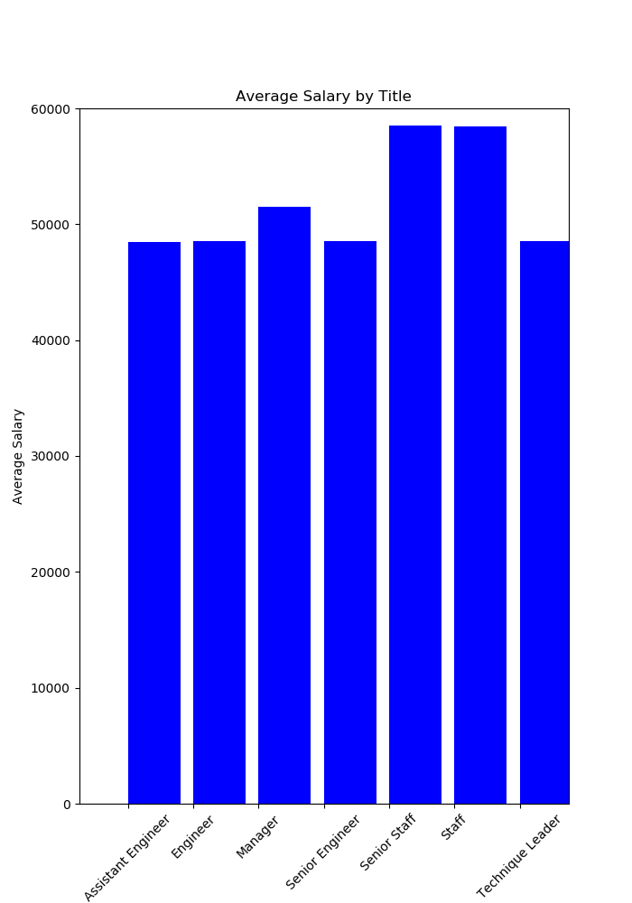

# Employee-Research
My employer wanted me to go through records of previous employees to see what to look for in future potential employees. I was given a total of six csv files worth of employee data from the 1980's and the 1990's, in which I imported them into a SQL database where I joined tables and parsed through the data to find the information that my employer was looking for.

